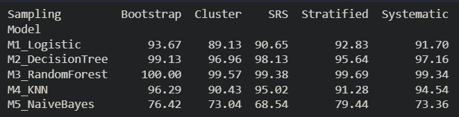

# Impact of Sampling Techniques on Balanced Credit Card Dataset

## Objective
- To study the effect of different sampling techniques on machine learning model performance.
- To compare model accuracy after balancing an imbalanced credit card fraud dataset.

## Dataset
- Credit card transaction dataset
- Binary classes:
  - 0 → Non-Fraud
  - 1 → Fraud
- Original dataset is highly imbalanced.

## Data Balancing
- **SMOTE (Synthetic Minority Over-sampling Technique)**
  - Generates synthetic samples for the minority class
  - Balances the dataset without removing majority class data
  - Improves model learning and stability

## Sampling Techniques Used
- **Simple Random Sampling (SRS):**
  - Each data point has equal probability of selection.
- **Stratified Sampling:**
  - Maintains class proportions in the sample.
- **Systematic Sampling:**
  - Selects every k-th data point after a random start.
- **Cluster Sampling:**
  - Randomly selects entire clusters of data.
- **Bootstrap Sampling:**
  - Sampling with replacement to assess model stability.

## Machine Learning Models Used
- M1: Logistic Regression
- M2: Decision Tree
- M3: Random Forest
- M4: K-Nearest Neighbors (KNN)
- M5: Naive Bayes

## Methodology
- Load and preprocess dataset
- Scale features using StandardScaler
- Balance dataset using SMOTE
- Apply sampling techniques
- Train machine learning models
- Evaluate performance using accuracy

## Results
- The table below shows accuracy (%) for each model–sampling combination.
- **MiSj represents accuracy of Model i using Sampling technique j.**

## Key Observations
- SMOTE significantly improves overall model performance.
- Random Forest achieves the highest accuracy across most sampling techniques.
- Stratified and Simple Random Sampling produce stable results.
- Cluster Sampling shows relatively lower accuracy due to reduced data diversity.

## Conclusion
- Balancing an imbalanced dataset is essential before applying sampling techniques.
- Sampling strategy influences model performance and stability.
- No single sampling technique is optimal for all models.

## How to Run
- Clone the repository
- Install required Python libraries
- Run the notebook or Python script
